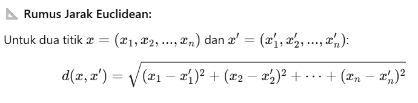

# Laporan Proyek Machine Learning - Ahmad Kholish Fauzan Shobiry

## Domain Proyek
Penyakit jantung merupakan penyebab utama kematian di dunia. Menurut data World Health Organization (WHO), sekitar 17,9 juta orang meninggal setiap tahun karena penyakit kardiovaskular, yang mewakili 31% dari seluruh kematian global.  
Identifikasi dini sangat penting dalam menurunkan angka kematian dan memberikan penanganan yang tepat bagi pasien.

Saat ini, proses diagnosis penyakit jantung sering kali melibatkan banyak uji medis yang kompleks dan memakan waktu. Dengan bantuan Machine Learning, kita dapat membangun sistem prediksi berbasis data medis untuk mendeteksi kemungkinan seseorang menderita penyakit jantung secara lebih cepat dan efisien.

**Mengapa masalah ini penting diselesaikan?**
1. Deteksi dini = meningkatkan peluang kesembuhan
2. Membantu dokter/tenaga medis sebagai sistem pendukung keputusan
3. Menghemat waktu & biaya diagnosis manual

**Referensi:**
- World Health Organization. (2021). *Cardiovascular Diseases (CVDs)*. Retrieved from [WHO Website](https://www.who.int/news-room/fact-sheets/detail/cardiovascular-diseases-(cvds))

---

## Business Understanding

### Problem Statements
- **Pernyataan Masalah 1:** Bagaimana memprediksi kemungkinan seseorang terkena penyakit jantung berdasarkan data medis yang tersedia?
- **Pernyataan Masalah 2:** Bagaimana membangun model Machine Learning yang efektif dan akurat untuk membantu diagnosis penyakit jantung?
- **Pernyataan Masalah 3:** Apa saja fitur (variabel) yang paling berpengaruh terhadap prediksi penyakit jantung?

### Goals
- **Goal 1:** Membuat model prediksi berbasis data medis yang dapat mengklasifikasikan apakah seorang pasien memiliki penyakit jantung atau tidak.
- **Goal 2:** Mencapai model dengan performa evaluasi (akurasi, precision, recall, dan F1 score) yang tinggi untuk dapat digunakan dalam sistem pendukung keputusan medis.
- **Goal 3:** Melakukan analisis feature importance dari model untuk mengidentifikasi fitur-fitur medis yang paling signifikan terhadap diagnosis penyakit jantung.

### Solution Statements
- Menggunakan beberapa model Machine Learning seperti Logistic Regression, Decision Tree, dan Random Forest.
- Melakukan evaluasi menggunakan metrik klasifikasi.
- Memilih model terbaik berdasarkan nilai F1 Score.
- Melakukan hyperparameter tuning pada model Random Forest untuk meningkatkan performa.

---

## Data Understanding

**Dataset:**  
- Nama Dataset: Heart Disease UCI
- Sumber Dataset: [Kaggle - Heart Failure Prediction Dataset](https://www.kaggle.com/datasets/fedesoriano/heart-failure-prediction)
- Data memiliki 918 baris dan 12 Kolom.

**Deskripsi Fitur:**
- **age** : Umur pasien
- **sex** : Jenis kelamin (1 = laki-laki; 0 = perempuan)
- **ChestPainType** : Tipe nyeri dada (0-3)
- **RestingBP** : Tekanan darah istirahat (mm Hg)
- **Cholesterol** : Kolesterol serum (mm/dl)
- **FastingBS** : Gula darah puasa > 120 mg/dl (1 = true; 0 = false)
- **RestingECG** : Hasil elektrokardiografi saat istirahat (0-2)
- **MaxHR** : Detak jantung maksimum yang dicapai
- **ExerciseAngina** : Angina yang diinduksi oleh olahraga (1 = ya; 0 = tidak)
- **0ldpeak** : Depresi ST yang diinduksi oleh olahraga relatif terhadap istirahat
- **ST_Slope** : Kemiringan segmen ST latihan puncak (0-2)
- **HeartDisease** : 1 = memiliki penyakit jantung, 0 = tidak memiliki penyakit jantung

**Hasil Temuan**
- Tidak ada missing value: Semua kolom memiliki 918 data lengkap.
- Tipe data: Beberapa kolom bertipe object padahal seharusnya kategorikal (misalnya: Sex, ChestPainType, RestingECG, ExerciseAngina, ST_Slope). Perlu diubah agar bisa diencoding dengan benar.
- Nilai tidak valid: RestingBP dan Cholesterol mengandung nilai 0 yang kemungkinan tidak valid.
- Oldpeak memiliki nilai negatif, yang mencurigakan.
- Distribusi target: Kolom HeartDisease cukup seimbang (~55% positif).
- Statistik penting:
  - Usia rata-rata: 53.5 tahun (28–77).
  - MaxHR maksimum: 202 (masuk akal).
  - FastingBS: biner (0 atau 1), sesuai definisi.

**Hasil Temuan Korelasi Antar Fitur**

Temuan ini didapatkan setelah semua fitur diStandarisasi,dari Heatmap di atas, kita mendapatkan beberapa insights untuk membantu kita memahami hubungan antar fitur, terutama dengan label HeartDisease., antara lain:
1. Korelasi terhadap Target (HeartDisease)
Kolom HeartDisease adalah target/label. Kita ingin tahu fitur mana yang paling berpengaruh terhadapnya (nilai korelasi tertinggi mutlak):
- Korelasi positif dengan HeartDisease:
  - Oldpeak (0.40): Semakin tinggi Oldpeak, semakin besar kemungkinan menderita penyakit jantung.
  - FastingBS (0.27): Gula darah puasa tinggi cenderung terkait dengan penyakit jantung.
  - Age (0.28): Usia lebih tua sedikit meningkatkan risiko.
  - Sex_M (0.31): Pria sedikit lebih berisiko dalam dataset ini.

- Korelasi negatif dengan HeartDisease:
  - MaxHR (-0.40): Semakin tinggi detak jantung maksimum, semakin rendah kemungkinan terkena penyakit jantung.
  - ST_Slope_Up (-0.62): Slope yang menanjak sangat kuat dikaitkan dengan tidak adanya penyakit jantung.
  - ExerciseAngina_Y (-0.49): Punya angina saat olahraga berkorelasi negatif — ini tampak aneh dan bisa berarti perlu dicek interpretasi kolom (mungkin 'Y' = tidak ada angina dalam encoding).
  - ST_Slope_Flat (0.55): Korelasi positif kuat, menunjukkan flat slope sering terjadi pada pasien dengan penyakit jantung.
  Korelasi tertinggi absolut: ST_Slope_Up dan ST_Slope_Flat (dengan arah berlawanan), bisa sangat penting dalam prediksi.

2. Korelasi Antar Fitur (Multikolinearitas)
Beberapa fitur punya korelasi tinggi satu sama lain:
  - ST_Slope_Up vs ST_Slope_Flat: -0.87 → Sangat kuat. Bisa pertimbangkan untuk drop salah satunya (jika pakai model linear) atau hati-hati saat interpretasi.
  - ExerciseAngina_Y vs ST_Slope_Up: -0.46
  - Oldpeak vs ST_Slope_Up: -0.45
  Korelasi tinggi antar fitur bisa menyebabkan multikolinearitas → tidak masalah untuk tree-based model, tapi penting jika pakai regresi/logistic regression.

3. Fitur dengan Korelasi Lemah
Fitur-fitur yang memiliki korelasi lemah (mendekati 0) dengan target HeartDisease:
  - Cholesterol (0.08)
  - RestingBP (0.12)
  - RestingECG_ST (0.10)
  - ChestPainType_TA (0.11)
 Bisa dipertimbangkan untuk dieliminasi atau digabungkan tergantung performa model nanti.

4. Distribusi ChestPainType
Terdapat dummy variable untuk tipe nyeri dada:
  - ChestPainType_ATA (-0.26)
  - ChestPainType_NAP (-0.21)
  - ChestPainType_TA (0.11)
 ATA dan NAP memiliki korelasi negatif → bisa jadi jenis nyeri ini lebih umum pada pasien tanpa penyakit jantung.

---

## Data Preparation

**Tahapan:**
- **Mengisi missing values/nilai yang tidak valid** pada fitur tertentu dengan nilai median.
- **Encoding** data kategorikal seperti `Sex`, `ChestPainType`, `RestingECG`, `ST_Slope`, `ExerciseAngina` menggunakan one-hot encoding.
- **Normalisasi** fitur numerik dengan StandardScaler untuk mempercepat konvergensi model.
- **Split dataset** menjadi training dan testing set (80% training, 20% testing).

**Alasan:**
- Mengatasi missing values untuk mencegah bias.
- Encoding penting untuk model yang tidak bisa bekerja langsung dengan variabel kategorikal.
- Normalisasi memastikan semua fitur berada pada skala yang sama untuk optimasi model.

---

## Model Development

**Model yang digunakan:**
- **Logistic Regression**
  - Cara Kerja: Logistic Regression bekerja dengan menghitung probabilitas bahwa suatu sampel masuk ke kelas 1, menggunakan fungsi sigmoid:
  Model kemudian mengoptimalkan bobot w_i agar prediksi probabilitas sesuai dengan label.
  - `max_iter=1000`: model akan melakukan maksimal 1000 iterasi saat mencari bobot optimal agar konvergen (terutama penting jika data tidak terkonvergensi dalam default 100 iterasi).
- **Random Forest**
  - `random_state=42`: untuk memastikan hasil yang konsisten setiap kali kode dijalankan.
  - `Random Forest` terdiri dari N decision trees = {T1, T2, T3, …,TN}
  - Setiap pohon dilatih pada data dan fitur yang berbeda (randomness), prediksi akhir berdasarkan voting mayoritas `y_pred_rf = rf.predict(X_test)`
- **K-Nearest Neighbor**
  - `KNeighborsClassifier(n_neighbors=5)`: artinya model akan melihat 5 tetangga terdekat (k=5) untuk menentukan kelas dari data baru.
  - `y_pred_knn = knn.predict(X_test_scaled)`: Untuk setiap titik pada `X_test_scaled`, model:
    - Mengukur jarak antara titik tersebut dan semua data di X_train_scaled.
    - Menemukan k tetangga terdekat (dalam hal ini 5) berdasarkan jarak terkecil (default: Euclidean distance) .
    - Mengambil mayoritas label dari tetangga tersebut sebagai prediksi kelas.
  - `confusion_matrix`: Menunjukkan berapa banyak prediksi yang benar/salah (TP, TN, FP, FN).

Berikut perbandingan peforma ketiga model di atas:

**Insights Modelling:**
 1. Logistic Regression
  - Precision tertinggi (0.91) → berarti ketika model memprediksi seseorang menderita penyakit jantung, 91% benar.
  - Recall (0.84) → model bisa menangkap 84% dari pasien yang benar-benar sakit.
  - Confusion Matrix: hanya 9 false positive dan 17 false negative.
 Ini adalah model paling seimbang, cocok untuk baseline dan interpretasi medis karena model ini cukup transparan.

2. Random Forest, performa mirip Logistic Regression, tapi:
  - Precision lebih rendah (0.88)
  - Recall sedikit lebih baik (0.85)
 **Random Forest bagus untuk menangani fitur non-linear, dan toleran terhadap multikolinearitas. Bisa jadi pilihan kuat kalau kamu ingin eksplorasi feature importance nanti.**

3. K-Nearest Neighbors
  - Precision (0.89) dan Recall (0.84) cukup baik.
  - Model ini sederhana tapi efektif, cocok untuk dataset kecil seperti ini.
  - Kelebihan: Tidak butuh pelatihan panjang
  - Kekurangan: Performanya bisa menurun drastis jika jumlah data besar atau noise tinggi.

**Kelebihan dan Kekurangan:**
- Logistic Regression: Mudah diinterpretasikan, performa baseline baik.
- Decision Tree: Interpretasi mudah tapi rawan overfitting.
- Random Forest: Performa tinggi, robust terhadap overfitting, tapi lebih kompleks.

Sebab untuk mencari variabel yang berpengaruh pada deteksi penyakit jantung, maka disini saya menggunakan Random Forest yang bersifat toleran terhadap multikolinearitas untuk mencari feature importance. Sebelumnya, mari mencari kombinasi hyperparameter terbaik Random Forest menggunakan GridSearchCV.

**Improvement:**
- **Hyperparameter Tuning** dilakukan pada Random Forest menggunakan Grid Search.
  - Dicoba parameter: `n_estimators`, `max_depth`, `min_samples_split`
  - Model hasil tuning menunjukkan peningkatan pada F1 Score.
- **Hasil Hyperparameter Tuning**
 Best Parameters:
  - n_estimators: 200
  - min_samples_split: 2
  - min_samples_leaf: 2
  - max_depth: None → artinya tidak dibatasi (pohon bisa sangat dalam)
 Best F1 Score (CV): ~0.887 → meningkat dari sebelumnya.

Setelah melakukan Tuning, kita akan melakukan Feature Importance untuk mengetahui variabel/fitur apa saja yang mempengaruhi perdiksi penilaian kemungkinan penyakit jantung, berikut hasilnya:

### Cara interpretasi Nilai Feature Importance
1. Skala Nilai Feature Importance
  - Nilai feature importance berada dalam rentang 0 hingga 1.
  - Semua nilai fitur dinormalisasi sehingga jika dijumlahkan, totalnya menjadi 1.
  - Semakin besar nilai feature importance, semakin besar kontribusi fitur tersebut terhadap prediksi model.

2. Makna Angka Feature Importance
  - Contoh: Jika sebuah fitur memiliki nilai importance sebesar 0.175, artinya fitur tersebut menyumbang 17.5% terhadap keseluruhan keputusan yang dibuat oleh model.
  - Fitur dengan nilai mendekati 0 memiliki pengaruh yang sangat kecil, sehingga dapat dipertimbangkan untuk dihapus dalam proses feature selection untuk menyederhanakan model atau tidak terpilih sebagau fitur yang signifikan.

3. Cara Model Menilai Pentingnya Fitur
 Random Forest menghitung feature importance berdasarkan berapa banyak impurity yang dikurangi oleh fitur tersebut di seluruh decision tree dalam hutan.
---

## Evaluation

**Metrik Evaluasi:**
- **Accuracy**: Rasio prediksi yang benar terhadap semua prediksi.
- **Precision**: Proporsi prediksi positif yang benar-benar positif.
- **Recall**: Proporsi positif yang benar yang berhasil ditemukan.
- **F1 Score**: Harmonik rata-rata precision dan recall.

**Formula:**
- Precision = TP / (TP + FP)
- Recall = TP / (TP + FN)
- F1 Score = 2 * (Precision * Recall) / (Precision + Recall)

**Hasil Evaluasi Model**
Berikut hasil evaluasi 4 model yang diuji dalam proyek ini:
1. Logistic Regression  
    Accuracy: 0.86  
    Precision: 0.91  
    Recall: 0.84  
    F1 Score: 0.87
2. Random Forest (default)  
    Accuracy: 0.85  
    Precision: 0.88  
    Recall: 0.85  
    F1 Score: 0.87
3. K-Nearest Neighbors (KNN)  
    Accuracy: 0.85  
    Precision: 0.89  
    Recall: 0.84  
    F1 Score: 0.87
4. Random Forest (setelah tuning hyperparameter)  
    Accuracy: 0.86  
    Precision: 0.89  
    Recall: 0.88  
    F1 Score: 0.88

**Rangkuman Evaluasi Model:**
1. Random Forest dengan hyperparameter tuning menghasilkan performa terbaik dengan F1 Score 0.88, mengungguli model lain.
2. Fitur-fitur paling penting dalam prediksi meliputi: ST_Slope_Up, ST_Slope_Flat, Oldpeak, dan ExerciseAngina_Y.
3. Model mampu menjaga keseimbangan antara presisi dan recall, yang sangat penting dalam deteksi penyakit jantung agar tidak banyak kasus positif yang lolos (false negative).
4. Model baseline seperti Logistic Regression juga memberikan hasil yang baik, namun masih kalah sedikit dibanding Random Forest setelah tuning.

Berdasarkan proses pemodelan dan tuning yang telah dilakukan, maka seluruh 3 problem statements di atas telah berhasil terjawab, jawaban yang ada juga disesuaikan dengan Solution Statement masing-masing, antara lain:
1. Poblem Statement 1:
    - Bagaimana cara mengidentifikasi pasien yang berpotensi menderita penyakit jantung berdasarkan data medis numerik?
      - Untuk menjawab ini, saya menerapkan 3 algoritma machine learning untuk menentukan model terbaik dalam sistem prediksi ini, antara lain Logistic Regression, K-Nearest Neighbor, dan Random Forest.
2. Problem Statement 2:
    - Algoritma machine learning mana yang paling optimal untuk melakukan prediksi penyakit jantung?
      - Dapat diketahui pada model bahwa ada kemiripan hasil yang sama optimalnya antara model Random Forest dan Logistic Regression. Namun, nilai Recall model Random Forest sedikit lebih baik, selain itu, Random Forest bagus untuk menangani fitur non-linear, dan toleran terhadap multikolinearitas, sehingga hasil fitur pada sistem prediksi ini lebih kuat dan robust terhadap overfitting yang memungkinkan hasil prediksi juga lebih kuat dibanding yang lain juga dengan nilai akurasi yang tinggi. Maka model Random Forest adalah algoritma yang paling optimal dibandingkan dengan 2 algoritma lainnya.
3. Problem Statement 3:
    - Apa saja fitur (variabel) yang paling berpengaruh terhadap prediksi penyakit jantung?
      - Pertanyaan ini dijawab menggunakan fungsi feature importance yang telah dimiliki oleh algoritma Random Forest itu sendiri, dan hasilnya lebih robust terhadap overfitting ataupun nanti dengan input yang berbeda-beda dengan hasil akurasi yang tetap maksimal setelah melalui proses fine-tuning menggunakan GridSearchCV sebesar 88.7%
